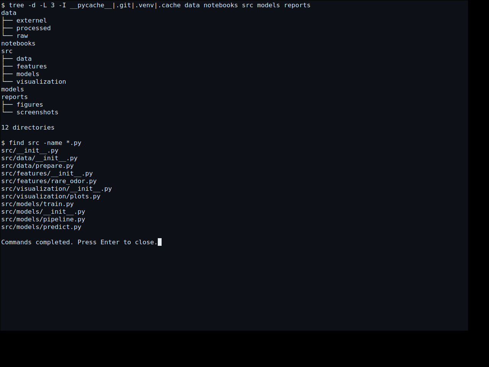
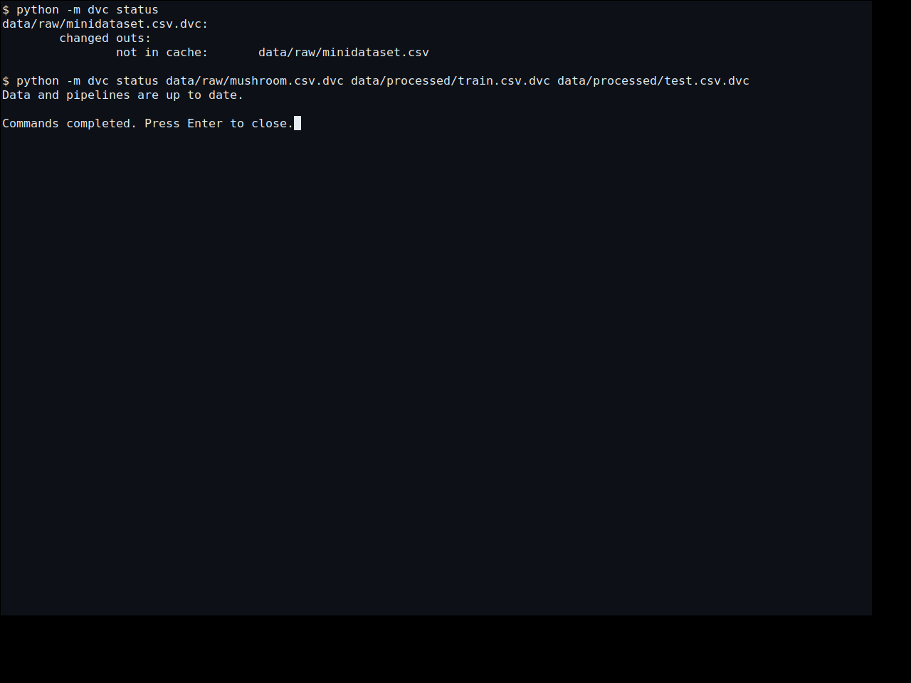
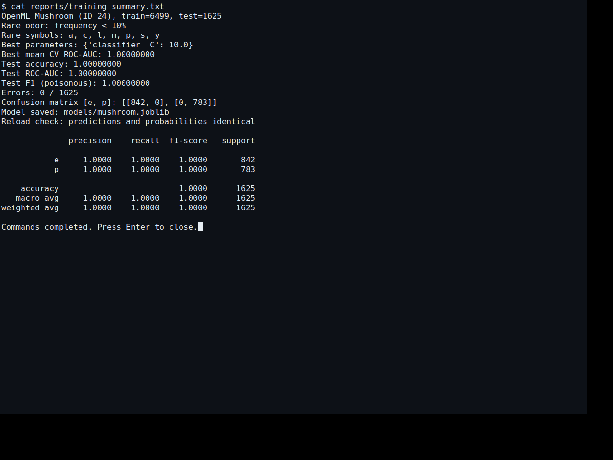
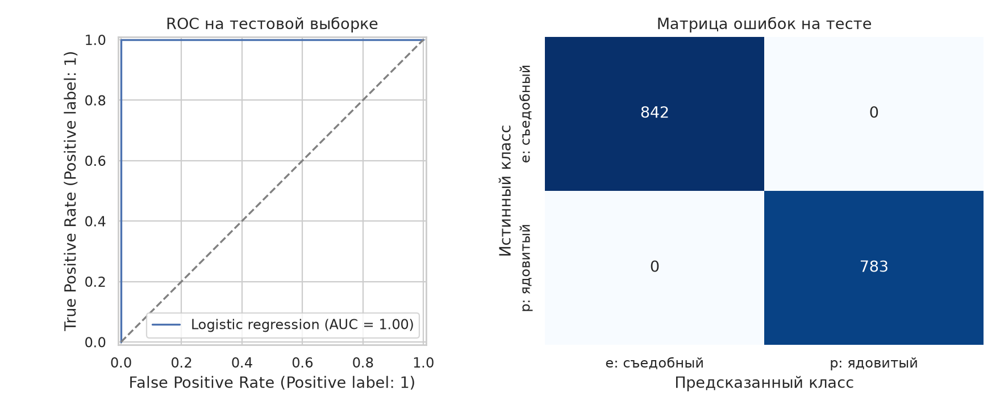

# Лабораторная работа 1 — Mushroom

Вариант 16. Классификация съедобности грибов с Git, DVC и единым Pipeline.
Редкий код odor — встречающийся **строго менее чем в 10% строк train**.

## Выполнение

Код реализован и был проверен в рабочем окружении: 11 тестов прошли,
на 1625 тестовых строках accuracy = ROC-AUC = F1 = 1.0, ошибок нет.
Повторная загрузка и обучение в копии без данных и кэшей дали побайтно
одинаковые данные, модель, отчёты и DVC-указатели.

После отключения окружения код восстановлен из выполненной работы.
Workflow `Reproduce laboratory 1` повторяет проверки на GitHub Actions
и сохраняет фактически полученные модель, отчёты и скриншоты в `lab1`.
До успешного завершения этого запуска комплект артефактов не считается
полностью восстановленным. Статус можно проверить на вкладке Actions.

## Быстрый запуск

Python 3.12, команды из корня репозитория:

```bash
python -m venv .venv
source .venv/bin/activate
python -m pip install -r requirements.txt
python -m src.data.prepare
python -m src.models.train
dvc add data/raw/mushroom.csv
dvc add data/processed/train.csv data/processed/test.csv
python -m pytest -q
ruff check src tests scripts
python -m src.models.predict data/processed/test.csv
```

Для независимой проверки воспроизводимости: `python scripts/verify_reproducibility.py`.
Для обзорного ноутбука: `python scripts/build_notebook.py`, затем
`jupyter lab notebooks/lab1_review.ipynb`.

## Данные и разбиение

Источник — [Mushroom, OpenML ID 24, версия 1](https://www.openml.org/d/24).
Загрузка: `fetch_openml(data_id=24, as_frame=True)`. Фиксированный ID и
проверка SHA-256 защищают от незаметного изменения набора.

- 8124 строки, 22 категориальных признака и цель `class`.
- `e` — съедобный, `p` — ядовитый; положительный класс ROC-AUC/F1 — `p`.
- 2480 пропусков в `stalk-root`; маркер `?` распознаётся как NaN.
- Искусственные пропуски не добавлялись: требование относится только
  к наборам без пропусков. Исходных числовых колонок в Mushroom нет.
- Разбиение до обучения: 80/20, `random_state=42`, `stratify=class`.
  Train — 6499 строк, test — 1625. Дубликатов по признакам не обнаружено.
- В сохранённых split-файлах `source_row` служит для проверки индексов;
  ни он, ни `class` не передаются модели в качестве признаков.

## Кастомный трансформер

`RareOdorCounter` наследует `TransformerMixin` и `BaseEstimator`.
`fit` запоминает частоты train; `transform` добавляет `odor_rare_count`,
не меняя входной DataFrame и не пересчитывая частоты по test.
В каждом odor одна буква, поэтому количество редких символов равно 0 или 1.
Частота ровно 10% не считается редкой. Неизвестный код имеет частоту 0
и получает 1. Пропуск остаётся NaN для числовой импутации.

| Код | Запах | Строк в train | Доля | Редкий |
| --- | --- | ---: | ---: | --- |
| m | Затхлый | 27 | 0,42% | Да |
| c | Креозотовый | 154 | 2,37% | Да |
| p | Резкий | 194 | 2,99% | Да |
| a | Миндальный | 318 | 4,89% | Да |
| l | Анисовый | 319 | 4,91% | Да |
| s | Пряный | 450 | 6,92% | Да |
| y | Рыбный | 457 | 7,03% | Да |
| f | Зловонный | 1754 | 26,99% | Нет |
| n | Без запаха | 2826 | 43,48% | Нет |

Порог выбран после просмотра train-частот: до 7,03% лежит группа редких
кодов, следующая частота — 26,99%. Это выбранное правило, а не универсальная
граница редкости. Расшифровки — [UCI](https://archive.ics.uci.edu/dataset/73/mushroom).

## Pipeline и подбор модели

1. `RareOdorCounter(threshold=0.10)` добавляет числовой счётчик.
2. `ColumnTransformer`: числовой счётчик проходит медиану и `StandardScaler`;
   22 категориальных признака — моду и `OneHotEncoder(handle_unknown='ignore')`.
3. `LogisticRegression(solver='lbfgs', max_iter=2000, random_state=42)`.

После обработки — 117 признаков: 116 one-hot колонок и счётчик.
Весь Pipeline передаётся в GridSearchCV. Каждый фолд заново обучает
частоты, импутеры, масштабирование и кодировщик; тест не участвует в подборе.
Использован StratifiedKFold: 5 фолдов, shuffle=True, random_state=42.
Перебор C: 0.1, 1.0, 10.0. Лучший C = 10.0 по среднему ROC-AUC.

| C | Средняя accuracy CV | Средний ROC-AUC CV | Ст. отклонение ROC-AUC |
| ---: | ---: | ---: | ---: |
| 0.1 | 0.997538 | 0.999569 | 0.000804 |
| 1.0 | 0.999385 | 0.999984 | 0.000031 |
| 10.0 | 0.999692 | 1.000000 | 0.000000 |

ROC-AUC оценивает порядок вероятностей, accuracy — решения при пороге.
Поэтому ROC-AUC = 1 на CV совместим с accuracy чуть ниже 1.

## Результаты и вывод

В выполненном запуске: accuracy = 1.0, ROC-AUC = 1.0, F1 = 1.0.
Матрица ошибок с порядком классов e, p: `[[842, 0], [0, 783]]`.
Точные результаты воспроизведения сохраняются в `reports/metrics.json`
и `reports/cv_results.csv`; прогноз каждой строки — в `reports/test_predictions.csv`.

Высокое качество относится к фиксированному тесту учебного набора и не
гарантирует результат для реальных грибов. Счётчик вычислен из имеющегося
odor; сравнение без него не проводилось, поэтому нельзя приписать
полученное качество только кастомному признаку.

## Git, DVC и сохранение

Исходные Git, DVC, .gitignore и каталоги сохранены. В requirements.txt
зафиксированы версии прямых и транзитивных зависимостей. Код сопровождается
docstring и комментариями, проверяется Ruff с ограничением 79 символов.

Под DVC находятся raw Mushroom и два split-файла; CSV исключены из Git.
Весь небольшой Pipeline хранится в `models/mushroom.joblib` в Git,
включая обученные преобразования. После загрузки joblib проверяется
полное совпадение предсказаний и вероятностей.

**DVC remote не настроен.** После клонирования данные восстанавливаются
командами prepare/train, а не dvc pull. Приведённые dvc add заполняют
локальный кэш; для тех же байтов указатели не меняются.

Старый `data/raw/minidataset.csv.dvc` сохранён; его CSV отсутствовал уже
в исходном репозитории. Полный dvc status сообщает об этом. Для Mushroom:

```bash
dvc status data/raw/mushroom.csv.dvc data/processed/train.csv.dvc data/processed/test.csv.dvc
```

Ожидаемый вывод после подготовки: `Data and pipelines are up to date.`

## Скриншоты

Workflow снимает настоящие окна xterm после выполнения команд, без
отрисовки имитаций терминала. Файлы появляются после успешного запуска.
Отдельный интерфейс приложения для лабораторной не разрабатывался.









## Навигация

| Файл | Назначение |
| --- | --- |
| src/data/prepare.py | Загрузка, проверка снимка, разбиение, частоты |
| src/features/rare_odor.py | Кастомный трансформер |
| src/models/pipeline.py | Две ветви обработки и модель |
| src/models/train.py | CV, оценка теста и сохранение |
| src/models/predict.py | Прогноз из сохранённой модели |
| scripts/verify_reproducibility.py | Повторный запуск без кэшей |
| scripts/build_notebook.py | Выполняемый обзорный ноутбук |
| tests/ | Проверки порога, импутации, разбиения и joblib |
| reports/checklist.md | Повторная сверка с заданием |

Рекомендации scikit-learn: [Pipeline](https://scikit-learn.org/1.8/modules/compose.html),
[утечка данных](https://scikit-learn.org/1.8/common_pitfalls.html).
